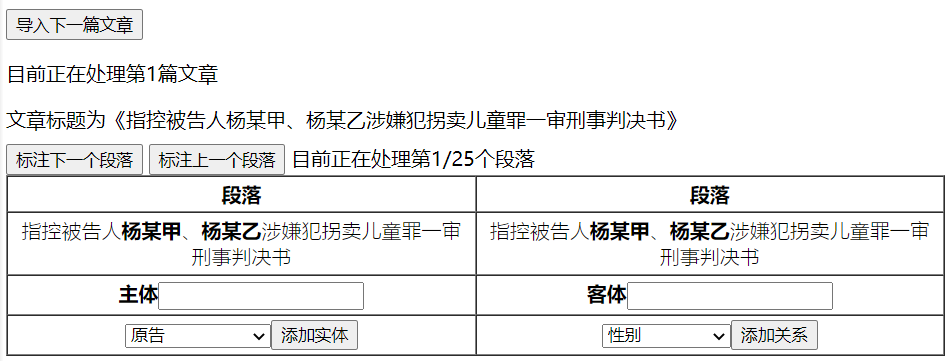
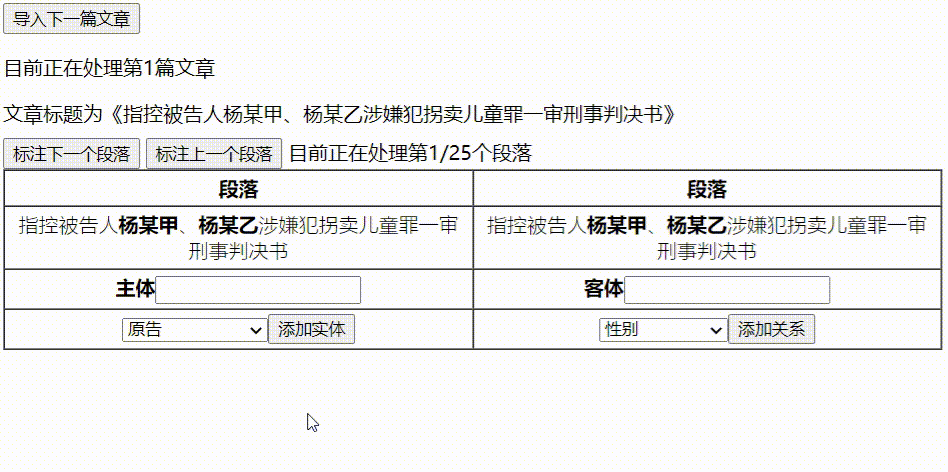
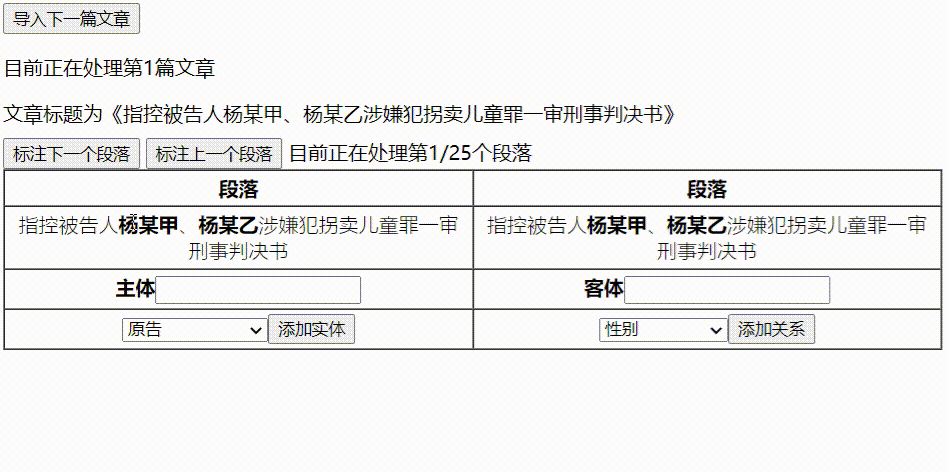
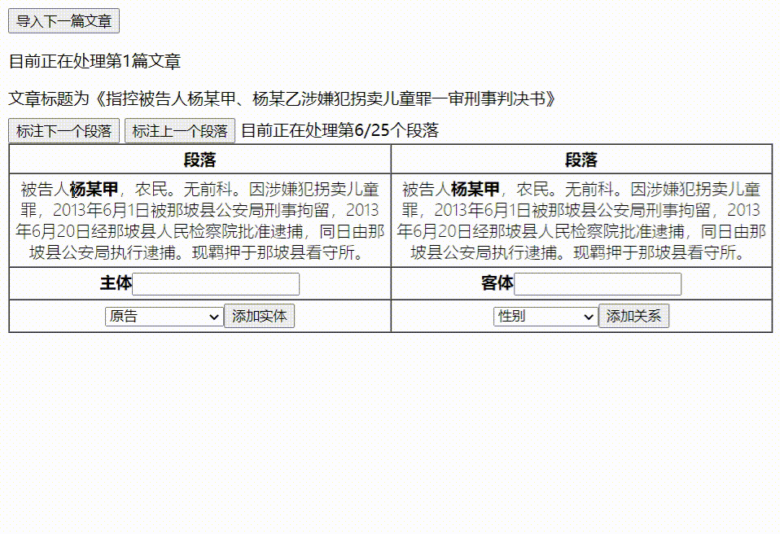
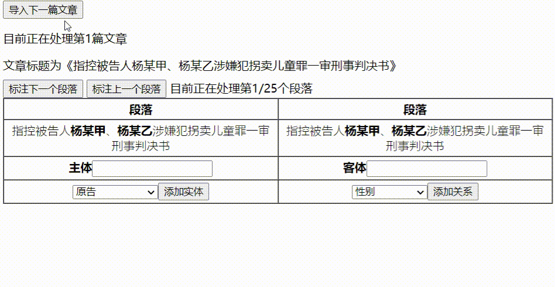

## 用户手册
1. 标注工具网址为**10.130.156.2533:8080/姓名缩写（如郭子铭的网站为10.130.156.213:8080/gzm）**，登录网站后页面如下图。

2. 点击**标注下一个段落**或者**标注上一个段落**可以显示文章的中不同的段落。

3. 如需**添加实体**，则在**主体**方框上的段落中框选实体名称，在**下拉选框**中选择实体类型，然后点击**添加实体**按钮，即可完成添加。

4. 如需**添加关系**，则在**主体**方框上的段落中框选主体名称，在**客体**方框上的段落中框选择客体名称，在**下拉选框**中选择关系类型，然后点击**添加关系**按钮，即可完成添加。

5. 如该篇法律文本已标注完毕，点击**导入下一篇文章**按钮，即可继续标注。

